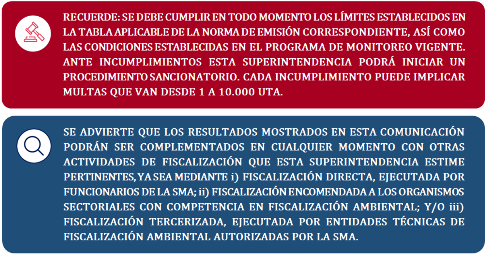

```{r setup, include=FALSE}
knitr::opts_chunk$set(echo = FALSE, warning = FALSE, message = FALSE, error = FALSE, fig.align = 'center')
```

```{r datos_funciones}
source("ScriptsApoyo/Datos.R", encoding = "UTF-8")
source("ScriptsApoyo/Diccionario.R", encoding = "UTF-8")
source("ScriptsApoyo/mapa.R", encoding = "UTF-8")
source("ScriptsApoyo/FuncionTabla.R", encoding = "UTF-8")
```

---
subtitle: `r str_to_title(unique(verificaciones$EstablecimientoNombre))`
---

</br>
</br>

```{r tab_inicial}
source("ScriptsApoyo/TablaInicial.R", encoding = "UTF-8")
tab_inicial_formato
```

</br>
</br>

```{r, out.width = '200%'}

```

```{r manejo_datos}
source("ScriptsApoyo/informar.R", encoding = "UTF-8")
source("ScriptsApoyo/frecuencia.R", encoding = "UTF-8")
source("ScriptsApoyo/parametros.R", encoding = "UTF-8")
source("ScriptsApoyo/remuestreos.R", encoding = "UTF-8")
source("ScriptsApoyo/parametrosremuestreos.R", encoding = "UTF-8")
source("ScriptsApoyo/superacion.R", encoding = "UTF-8") 
```

```{r tab_evaluacion}
source("ScriptsApoyo/TablaEvaluacion.R", encoding = "UTF-8")
```

```{r}
numerotablas <- length(lista_tablas)
uno <- numerotablas == 1
dos <- numerotablas == 2
tres <- numerotablas == 3
cuatro <- numerotablas == 4
cinco <- numerotablas == 5
seis <- numerotablas == 6
siete <- numerotablas == 7
ocho <- numerotablas == 8
nueve <- numerotablas == 9
diez <- numerotablas == 10
once <- numerotablas == 11
doce <- numerotablas == 12
trece <- numerotablas == 13
catorce <- numerotablas == 14
quince <- numerotablas == 15
dieciseis <- numerotablas == 16
diecisiete <- numerotablas == 17
dieciocho <- numerotablas == 18
diecinueve <- numerotablas == 19
veinte <- numerotablas == 20

ductos <- lista_ductos$NombreDucto
```

`r if(uno){paste("####", "Ducto:", ductos[1])}`
`r if(uno){lista_tablas[[1]]}`

`r if(dos){paste("####", "Ducto:", ductos[1])}`
`r if(dos){lista_tablas[[1]]}`
`r if(dos){paste("####", "Ducto:", ductos[2])}`
`r if(dos){lista_tablas[[2]]}`

`r if(tres){paste("####", "Ducto:", ductos[1])}`
`r if(tres){lista_tablas[[1]]}`
`r if(tres){paste("####", "Ducto:", ductos[2])}`
`r if(tres){lista_tablas[[2]]}`
`r if(tres){paste("####", "Ducto:", ductos[3])}`
`r if(tres){lista_tablas[[3]]}`

`r if(cuatro){paste("####", "Ducto:", ductos[1])}`
`r if(cuatro){lista_tablas[[1]]}`
`r if(cuatro){paste("####", "Ducto:", ductos[2])}`
`r if(cuatro){lista_tablas[[2]]}`
`r if(cuatro){paste("####", "Ducto:", ductos[3])}`
`r if(cuatro){lista_tablas[[3]]}`
`r if(cuatro){paste("####", "Ducto:", ductos[4])}`
`r if(cuatro){lista_tablas[[4]]}`

`r if(cinco){paste("####", "Ducto:", ductos[1])}`
`r if(cinco){lista_tablas[[1]]}`
`r if(cinco){paste("####", "Ducto:", ductos[2])}`
`r if(cinco){lista_tablas[[2]]}`
`r if(cinco){paste("####", "Ducto:", ductos[3])}`
`r if(cinco){lista_tablas[[3]]}`
`r if(cinco){paste("####", "Ducto:", ductos[4])}`
`r if(cinco){lista_tablas[[4]]}`
`r if(cinco){paste("####", "Ducto:", ductos[5])}`
`r if(cinco){lista_tablas[[5]]}`

`r if(seis){paste("####", "Ducto:", ductos[1])}`
`r if(seis){lista_tablas[[1]]}`
`r if(seis){paste("####", "Ducto:", ductos[2])}`
`r if(seis){lista_tablas[[2]]}`
`r if(seis){paste("####", "Ducto:", ductos[3])}`
`r if(seis){lista_tablas[[3]]}`
`r if(seis){paste("####", "Ducto:", ductos[4])}`
`r if(seis){lista_tablas[[4]]}`
`r if(seis){paste("####", "Ducto:", ductos[5])}`
`r if(seis){lista_tablas[[5]]}`
`r if(seis){paste("####", "Ducto:", ductos[6])}`
`r if(seis){lista_tablas[[6]]}`

`r if(siete){paste("####", "Ducto:", ductos[1])}`
`r if(siete){lista_tablas[[1]]}`
`r if(siete){paste("####", "Ducto:", ductos[2])}`
`r if(siete){lista_tablas[[2]]}`
`r if(siete){paste("####", "Ducto:", ductos[3])}`
`r if(siete){lista_tablas[[3]]}`
`r if(siete){paste("####", "Ducto:", ductos[4])}`
`r if(siete){lista_tablas[[4]]}`
`r if(siete){paste("####", "Ducto:", ductos[5])}`
`r if(siete){lista_tablas[[5]]}`
`r if(siete){paste("####", "Ducto:", ductos[6])}`
`r if(siete){lista_tablas[[6]]}`
`r if(siete){paste("####", "Ducto:", ductos[7])}`
`r if(siete){lista_tablas[[7]]}`

`r if(ocho){paste("####", "Ducto:", ductos[1])}`
`r if(ocho){lista_tablas[[1]]}`
`r if(ocho){paste("####", "Ducto:", ductos[2])}`
`r if(ocho){lista_tablas[[2]]}`
`r if(ocho){paste("####", "Ducto:", ductos[3])}`
`r if(ocho){lista_tablas[[3]]}`
`r if(ocho){paste("####", "Ducto:", ductos[4])}`
`r if(ocho){lista_tablas[[4]]}`
`r if(ocho){paste("####", "Ducto:", ductos[5])}`
`r if(ocho){lista_tablas[[5]]}`
`r if(ocho){paste("####", "Ducto:", ductos[6])}`
`r if(ocho){lista_tablas[[6]]}`
`r if(ocho){paste("####", "Ducto:", ductos[7])}`
`r if(ocho){lista_tablas[[7]]}`
`r if(ocho){paste("####", "Ducto:", ductos[8])}`
`r if(ocho){lista_tablas[[8]]}`

`r if(nueve){paste("####", "Ducto:", ductos[1])}`
`r if(nueve){lista_tablas[[1]]}`
`r if(nueve){paste("####", "Ducto:", ductos[2])}`
`r if(nueve){lista_tablas[[2]]}`
`r if(nueve){paste("####", "Ducto:", ductos[3])}`
`r if(nueve){lista_tablas[[3]]}`
`r if(nueve){paste("####", "Ducto:", ductos[4])}`
`r if(nueve){lista_tablas[[4]]}`
`r if(nueve){paste("####", "Ducto:", ductos[5])}`
`r if(nueve){lista_tablas[[5]]}`
`r if(nueve){paste("####", "Ducto:", ductos[6])}`
`r if(nueve){lista_tablas[[6]]}`
`r if(nueve){paste("####", "Ducto:", ductos[7])}`
`r if(nueve){lista_tablas[[7]]}`
`r if(nueve){paste("####", "Ducto:", ductos[8])}`
`r if(nueve){lista_tablas[[8]]}`
`r if(nueve){paste("####", "Ducto:", ductos[9])}`
`r if(nueve){lista_tablas[[9]]}`

`r if(diez){paste("####", "Ducto:", ductos[1])}`
`r if(diez){lista_tablas[[1]]}`
`r if(diez){paste("####", "Ducto:", ductos[2])}`
`r if(diez){lista_tablas[[2]]}`
`r if(diez){paste("####", "Ducto:", ductos[3])}`
`r if(diez){lista_tablas[[3]]}`
`r if(diez){paste("####", "Ducto:", ductos[4])}`
`r if(diez){lista_tablas[[4]]}`
`r if(diez){paste("####", "Ducto:", ductos[5])}`
`r if(diez){lista_tablas[[5]]}`
`r if(diez){paste("####", "Ducto:", ductos[6])}`
`r if(diez){lista_tablas[[6]]}`
`r if(diez){paste("####", "Ducto:", ductos[7])}`
`r if(diez){lista_tablas[[7]]}`
`r if(diez){paste("####", "Ducto:", ductos[8])}`
`r if(diez){lista_tablas[[8]]}`
`r if(diez){paste("####", "Ducto:", ductos[9])}`
`r if(diez){lista_tablas[[9]]}`
`r if(diez){paste("####", "Ducto:", ductos[10])}`
`r if(diez){lista_tablas[[10]]}`

`r if(once){paste("####", "Ducto:", ductos[1])}`
`r if(once){lista_tablas[[1]]}`
`r if(once){paste("####", "Ducto:", ductos[2])}`
`r if(once){lista_tablas[[2]]}`
`r if(once){paste("####", "Ducto:", ductos[3])}`
`r if(once){lista_tablas[[3]]}`
`r if(once){paste("####", "Ducto:", ductos[4])}`
`r if(once){lista_tablas[[4]]}`
`r if(once){paste("####", "Ducto:", ductos[5])}`
`r if(once){lista_tablas[[5]]}`
`r if(once){paste("####", "Ducto:", ductos[6])}`
`r if(once){lista_tablas[[6]]}`
`r if(once){paste("####", "Ducto:", ductos[7])}`
`r if(once){lista_tablas[[7]]}`
`r if(once){paste("####", "Ducto:", ductos[8])}`
`r if(once){lista_tablas[[8]]}`
`r if(once){paste("####", "Ducto:", ductos[9])}`
`r if(once){lista_tablas[[9]]}`
`r if(once){paste("####", "Ducto:", ductos[10])}`
`r if(once){lista_tablas[[10]]}`
`r if(once){paste("####", "Ducto:", ductos[11])}`
`r if(once){lista_tablas[[11]]}`

`r if(doce){paste("####", "Ducto:", ductos[1])}`
`r if(doce){lista_tablas[[1]]}`
`r if(doce){paste("####", "Ducto:", ductos[2])}`
`r if(doce){lista_tablas[[2]]}`
`r if(doce){paste("####", "Ducto:", ductos[3])}`
`r if(doce){lista_tablas[[3]]}`
`r if(doce){paste("####", "Ducto:", ductos[4])}`
`r if(doce){lista_tablas[[4]]}`
`r if(doce){paste("####", "Ducto:", ductos[5])}`
`r if(doce){lista_tablas[[5]]}`
`r if(doce){paste("####", "Ducto:", ductos[6])}`
`r if(doce){lista_tablas[[6]]}`
`r if(doce){paste("####", "Ducto:", ductos[7])}`
`r if(doce){lista_tablas[[7]]}`
`r if(doce){paste("####", "Ducto:", ductos[8])}`
`r if(doce){lista_tablas[[8]]}`
`r if(doce){paste("####", "Ducto:", ductos[9])}`
`r if(doce){lista_tablas[[9]]}`
`r if(doce){paste("####", "Ducto:", ductos[10])}`
`r if(doce){lista_tablas[[10]]}`
`r if(doce){paste("####", "Ducto:", ductos[11])}`
`r if(doce){lista_tablas[[11]]}`
`r if(doce){paste("####", "Ducto:", ductos[12])}`
`r if(doce){lista_tablas[[12]]}`

`r if(trece){paste("####", "Ducto:", ductos[1])}`
`r if(trece){lista_tablas[[1]]}`
`r if(trece){paste("####", "Ducto:", ductos[2])}`
`r if(trece){lista_tablas[[2]]}`
`r if(trece){paste("####", "Ducto:", ductos[3])}`
`r if(trece){lista_tablas[[3]]}`
`r if(trece){paste("####", "Ducto:", ductos[4])}`
`r if(trece){lista_tablas[[4]]}`
`r if(trece){paste("####", "Ducto:", ductos[5])}`
`r if(trece){lista_tablas[[5]]}`
`r if(trece){paste("####", "Ducto:", ductos[6])}`
`r if(trece){lista_tablas[[6]]}`
`r if(trece){paste("####", "Ducto:", ductos[7])}`
`r if(trece){lista_tablas[[7]]}`
`r if(trece){paste("####", "Ducto:", ductos[8])}`
`r if(trece){lista_tablas[[8]]}`
`r if(trece){paste("####", "Ducto:", ductos[9])}`
`r if(trece){lista_tablas[[9]]}`
`r if(trece){paste("####", "Ducto:", ductos[10])}`
`r if(trece){lista_tablas[[10]]}`
`r if(trece){paste("####", "Ducto:", ductos[11])}`
`r if(trece){lista_tablas[[11]]}`
`r if(trece){paste("####", "Ducto:", ductos[12])}`
`r if(trece){lista_tablas[[12]]}`
`r if(trece){paste("####", "Ducto:", ductos[13])}`
`r if(trece){lista_tablas[[13]]}`

`r if(catorce){paste("####", "Ducto:", ductos[1])}`
`r if(catorce){lista_tablas[[1]]}`
`r if(catorce){paste("####", "Ducto:", ductos[2])}`
`r if(catorce){lista_tablas[[2]]}`
`r if(catorce){paste("####", "Ducto:", ductos[3])}`
`r if(catorce){lista_tablas[[3]]}`
`r if(catorce){paste("####", "Ducto:", ductos[4])}`
`r if(catorce){lista_tablas[[4]]}`
`r if(catorce){paste("####", "Ducto:", ductos[5])}`
`r if(catorce){lista_tablas[[5]]}`
`r if(catorce){paste("####", "Ducto:", ductos[6])}`
`r if(catorce){lista_tablas[[6]]}`
`r if(catorce){paste("####", "Ducto:", ductos[7])}`
`r if(catorce){lista_tablas[[7]]}`
`r if(catorce){paste("####", "Ducto:", ductos[8])}`
`r if(catorce){lista_tablas[[8]]}`
`r if(catorce){paste("####", "Ducto:", ductos[9])}`
`r if(catorce){lista_tablas[[9]]}`
`r if(catorce){paste("####", "Ducto:", ductos[10])}`
`r if(catorce){lista_tablas[[10]]}`
`r if(catorce){paste("####", "Ducto:", ductos[11])}`
`r if(catorce){lista_tablas[[11]]}`
`r if(catorce){paste("####", "Ducto:", ductos[12])}`
`r if(catorce){lista_tablas[[12]]}`
`r if(catorce){paste("####", "Ducto:", ductos[13])}`
`r if(catorce){lista_tablas[[13]]}`
`r if(catorce){paste("####", "Ducto:", ductos[14])}`
`r if(catorce){lista_tablas[[14]]}`

`r if(quince){paste("####", "Ducto:", ductos[1])}`
`r if(quince){lista_tablas[[1]]}`
`r if(quince){paste("####", "Ducto:", ductos[2])}`
`r if(quince){lista_tablas[[2]]}`
`r if(quince){paste("####", "Ducto:", ductos[3])}`
`r if(quince){lista_tablas[[3]]}`
`r if(quince){paste("####", "Ducto:", ductos[4])}`
`r if(quince){lista_tablas[[4]]}`
`r if(quince){paste("####", "Ducto:", ductos[5])}`
`r if(quince){lista_tablas[[5]]}`
`r if(quince){paste("####", "Ducto:", ductos[6])}`
`r if(quince){lista_tablas[[6]]}`
`r if(quince){paste("####", "Ducto:", ductos[7])}`
`r if(quince){lista_tablas[[7]]}`
`r if(quince){paste("####", "Ducto:", ductos[8])}`
`r if(quince){lista_tablas[[8]]}`
`r if(quince){paste("####", "Ducto:", ductos[9])}`
`r if(quince){lista_tablas[[9]]}`
`r if(quince){paste("####", "Ducto:", ductos[10])}`
`r if(quince){lista_tablas[[10]]}`
`r if(quince){paste("####", "Ducto:", ductos[11])}`
`r if(quince){lista_tablas[[11]]}`
`r if(quince){paste("####", "Ducto:", ductos[12])}`
`r if(quince){lista_tablas[[12]]}`
`r if(quince){paste("####", "Ducto:", ductos[13])}`
`r if(quince){lista_tablas[[13]]}`
`r if(quince){paste("####", "Ducto:", ductos[14])}`
`r if(quince){lista_tablas[[14]]}`
`r if(quince){paste("####", "Ducto:", ductos[15])}`
`r if(quince){lista_tablas[[15]]}`

`r if(dieciseis){paste("####", "Ducto:", ductos[1])}`
`r if(dieciseis){lista_tablas[[1]]}`
`r if(dieciseis){paste("####", "Ducto:", ductos[2])}`
`r if(dieciseis){lista_tablas[[2]]}`
`r if(dieciseis){paste("####", "Ducto:", ductos[3])}`
`r if(dieciseis){lista_tablas[[3]]}`
`r if(dieciseis){paste("####", "Ducto:", ductos[4])}`
`r if(dieciseis){lista_tablas[[4]]}`
`r if(dieciseis){paste("####", "Ducto:", ductos[5])}`
`r if(dieciseis){lista_tablas[[5]]}`
`r if(dieciseis){paste("####", "Ducto:", ductos[6])}`
`r if(dieciseis){lista_tablas[[6]]}`
`r if(dieciseis){paste("####", "Ducto:", ductos[7])}`
`r if(dieciseis){lista_tablas[[7]]}`
`r if(dieciseis){paste("####", "Ducto:", ductos[8])}`
`r if(dieciseis){lista_tablas[[8]]}`
`r if(dieciseis){paste("####", "Ducto:", ductos[9])}`
`r if(dieciseis){lista_tablas[[9]]}`
`r if(dieciseis){paste("####", "Ducto:", ductos[10])}`
`r if(dieciseis){lista_tablas[[10]]}`
`r if(dieciseis){paste("####", "Ducto:", ductos[11])}`
`r if(dieciseis){lista_tablas[[11]]}`
`r if(dieciseis){paste("####", "Ducto:", ductos[12])}`
`r if(dieciseis){lista_tablas[[12]]}`
`r if(dieciseis){paste("####", "Ducto:", ductos[13])}`
`r if(dieciseis){lista_tablas[[13]]}`
`r if(dieciseis){paste("####", "Ducto:", ductos[14])}`
`r if(dieciseis){lista_tablas[[14]]}`
`r if(dieciseis){paste("####", "Ducto:", ductos[15])}`
`r if(dieciseis){lista_tablas[[15]]}`
`r if(dieciseis){paste("####", "Ducto:", ductos[16])}`
`r if(dieciseis){lista_tablas[[16]]}`

`r if(diecisiete){paste("####", "Ducto:", ductos[1])}`
`r if(diecisiete){lista_tablas[[1]]}`
`r if(diecisiete){paste("####", "Ducto:", ductos[2])}`
`r if(diecisiete){lista_tablas[[2]]}`
`r if(diecisiete){paste("####", "Ducto:", ductos[3])}`
`r if(diecisiete){lista_tablas[[3]]}`
`r if(diecisiete){paste("####", "Ducto:", ductos[4])}`
`r if(diecisiete){lista_tablas[[4]]}`
`r if(diecisiete){paste("####", "Ducto:", ductos[5])}`
`r if(diecisiete){lista_tablas[[5]]}`
`r if(diecisiete){paste("####", "Ducto:", ductos[6])}`
`r if(diecisiete){lista_tablas[[6]]}`
`r if(diecisiete){paste("####", "Ducto:", ductos[7])}`
`r if(diecisiete){lista_tablas[[7]]}`
`r if(diecisiete){paste("####", "Ducto:", ductos[8])}`
`r if(diecisiete){lista_tablas[[8]]}`
`r if(diecisiete){paste("####", "Ducto:", ductos[9])}`
`r if(diecisiete){lista_tablas[[9]]}`
`r if(diecisiete){paste("####", "Ducto:", ductos[10])}`
`r if(diecisiete){lista_tablas[[10]]}`
`r if(diecisiete){paste("####", "Ducto:", ductos[11])}`
`r if(diecisiete){lista_tablas[[11]]}`
`r if(diecisiete){paste("####", "Ducto:", ductos[12])}`
`r if(diecisiete){lista_tablas[[12]]}`
`r if(diecisiete){paste("####", "Ducto:", ductos[13])}`
`r if(diecisiete){lista_tablas[[13]]}`
`r if(diecisiete){paste("####", "Ducto:", ductos[14])}`
`r if(diecisiete){lista_tablas[[14]]}`
`r if(diecisiete){paste("####", "Ducto:", ductos[15])}`
`r if(diecisiete){lista_tablas[[15]]}`
`r if(diecisiete){paste("####", "Ducto:", ductos[16])}`
`r if(diecisiete){lista_tablas[[16]]}`
`r if(diecisiete){paste("####", "Ducto:", ductos[17])}`
`r if(diecisiete){lista_tablas[[17]]}`

`r if(dieciocho){paste("####", "Ducto:", ductos[1])}`
`r if(dieciocho){lista_tablas[[1]]}`
`r if(dieciocho){paste("####", "Ducto:", ductos[2])}`
`r if(dieciocho){lista_tablas[[2]]}`
`r if(dieciocho){paste("####", "Ducto:", ductos[3])}`
`r if(dieciocho){lista_tablas[[3]]}`
`r if(dieciocho){paste("####", "Ducto:", ductos[4])}`
`r if(dieciocho){lista_tablas[[4]]}`
`r if(dieciocho){paste("####", "Ducto:", ductos[5])}`
`r if(dieciocho){lista_tablas[[5]]}`
`r if(dieciocho){paste("####", "Ducto:", ductos[6])}`
`r if(dieciocho){lista_tablas[[6]]}`
`r if(dieciocho){paste("####", "Ducto:", ductos[7])}`
`r if(dieciocho){lista_tablas[[7]]}`
`r if(dieciocho){paste("####", "Ducto:", ductos[8])}`
`r if(dieciocho){lista_tablas[[8]]}`
`r if(dieciocho){paste("####", "Ducto:", ductos[9])}`
`r if(dieciocho){lista_tablas[[9]]}`
`r if(dieciocho){paste("####", "Ducto:", ductos[10])}`
`r if(dieciocho){lista_tablas[[10]]}`
`r if(dieciocho){paste("####", "Ducto:", ductos[11])}`
`r if(dieciocho){lista_tablas[[11]]}`
`r if(dieciocho){paste("####", "Ducto:", ductos[12])}`
`r if(dieciocho){lista_tablas[[12]]}`
`r if(dieciocho){paste("####", "Ducto:", ductos[13])}`
`r if(dieciocho){lista_tablas[[13]]}`
`r if(dieciocho){paste("####", "Ducto:", ductos[14])}`
`r if(dieciocho){lista_tablas[[14]]}`
`r if(dieciocho){paste("####", "Ducto:", ductos[15])}`
`r if(dieciocho){lista_tablas[[15]]}`
`r if(dieciocho){paste("####", "Ducto:", ductos[16])}`
`r if(dieciocho){lista_tablas[[16]]}`
`r if(dieciocho){paste("####", "Ducto:", ductos[17])}`
`r if(dieciocho){lista_tablas[[17]]}`
`r if(dieciocho){paste("####", "Ducto:", ductos[18])}`
`r if(dieciocho){lista_tablas[[18]]}`

`r if(diecinueve){paste("####", "Ducto:", ductos[1])}`
`r if(diecinueve){lista_tablas[[1]]}`
`r if(diecinueve){paste("####", "Ducto:", ductos[2])}`
`r if(diecinueve){lista_tablas[[2]]}`
`r if(diecinueve){paste("####", "Ducto:", ductos[3])}`
`r if(diecinueve){lista_tablas[[3]]}`
`r if(diecinueve){paste("####", "Ducto:", ductos[4])}`
`r if(diecinueve){lista_tablas[[4]]}`
`r if(diecinueve){paste("####", "Ducto:", ductos[5])}`
`r if(diecinueve){lista_tablas[[5]]}`
`r if(diecinueve){paste("####", "Ducto:", ductos[6])}`
`r if(diecinueve){lista_tablas[[6]]}`
`r if(diecinueve){paste("####", "Ducto:", ductos[7])}`
`r if(diecinueve){lista_tablas[[7]]}`
`r if(diecinueve){paste("####", "Ducto:", ductos[8])}`
`r if(diecinueve){lista_tablas[[8]]}`
`r if(diecinueve){paste("####", "Ducto:", ductos[9])}`
`r if(diecinueve){lista_tablas[[9]]}`
`r if(diecinueve){paste("####", "Ducto:", ductos[10])}`
`r if(diecinueve){lista_tablas[[10]]}`
`r if(diecinueve){paste("####", "Ducto:", ductos[11])}`
`r if(diecinueve){lista_tablas[[11]]}`
`r if(diecinueve){paste("####", "Ducto:", ductos[12])}`
`r if(diecinueve){lista_tablas[[12]]}`
`r if(diecinueve){paste("####", "Ducto:", ductos[13])}`
`r if(diecinueve){lista_tablas[[13]]}`
`r if(diecinueve){paste("####", "Ducto:", ductos[14])}`
`r if(diecinueve){lista_tablas[[14]]}`
`r if(diecinueve){paste("####", "Ducto:", ductos[15])}`
`r if(diecinueve){lista_tablas[[15]]}`
`r if(diecinueve){paste("####", "Ducto:", ductos[16])}`
`r if(diecinueve){lista_tablas[[16]]}`
`r if(diecinueve){paste("####", "Ducto:", ductos[17])}`
`r if(diecinueve){lista_tablas[[17]]}`
`r if(diecinueve){paste("####", "Ducto:", ductos[18])}`
`r if(diecinueve){lista_tablas[[18]]}`
`r if(diecinueve){paste("####", "Ducto:", ductos[19])}`
`r if(diecinueve){lista_tablas[[19]]}`

`r if(veinte){paste("####", "Ducto:", ductos[1])}`
`r if(veinte){lista_tablas[[1]]}`
`r if(veinte){paste("####", "Ducto:", ductos[2])}`
`r if(veinte){lista_tablas[[2]]}`
`r if(veinte){paste("####", "Ducto:", ductos[3])}`
`r if(veinte){lista_tablas[[3]]}`
`r if(veinte){paste("####", "Ducto:", ductos[4])}`
`r if(veinte){lista_tablas[[4]]}`
`r if(veinte){paste("####", "Ducto:", ductos[5])}`
`r if(veinte){lista_tablas[[5]]}`
`r if(veinte){paste("####", "Ducto:", ductos[6])}`
`r if(veinte){lista_tablas[[6]]}`
`r if(veinte){paste("####", "Ducto:", ductos[7])}`
`r if(veinte){lista_tablas[[7]]}`
`r if(veinte){paste("####", "Ducto:", ductos[8])}`
`r if(veinte){lista_tablas[[8]]}`
`r if(veinte){paste("####", "Ducto:", ductos[9])}`
`r if(veinte){lista_tablas[[9]]}`
`r if(veinte){paste("####", "Ducto:", ductos[10])}`
`r if(veinte){lista_tablas[[10]]}`
`r if(veinte){paste("####", "Ducto:", ductos[11])}`
`r if(veinte){lista_tablas[[11]]}`
`r if(veinte){paste("####", "Ducto:", ductos[12])}`
`r if(veinte){lista_tablas[[12]]}`
`r if(veinte){paste("####", "Ducto:", ductos[13])}`
`r if(veinte){lista_tablas[[13]]}`
`r if(veinte){paste("####", "Ducto:", ductos[14])}`
`r if(veinte){lista_tablas[[14]]}`
`r if(veinte){paste("####", "Ducto:", ductos[15])}`
`r if(veinte){lista_tablas[[15]]}`
`r if(veinte){paste("####", "Ducto:", ductos[16])}`
`r if(veinte){lista_tablas[[16]]}`
`r if(veinte){paste("####", "Ducto:", ductos[17])}`
`r if(veinte){lista_tablas[[17]]}`
`r if(veinte){paste("####", "Ducto:", ductos[18])}`
`r if(veinte){lista_tablas[[18]]}`
`r if(veinte){paste("####", "Ducto:", ductos[19])}`
`r if(veinte){lista_tablas[[19]]}`
`r if(veinte){paste("####", "Ducto:", ductos[20])}`
`r if(veinte){lista_tablas[[20]]}`

```{r, out.width = '200%'}

```

## En caso de dudas comuníquese al correo: **riles@sma.gob.cl**

### Comunicación generada de manera automática, no responder.

`r if(!is.na(coord_ducto[1,1])){paste("##### a")}`

`r if(!is.na(coord_ducto[1,1])){paste("###### IMÁGEN SATELITAL:", str_to_upper(unique(UF_select$Nombre)))}`
 
```{r mensaje_mapa}
if(!is.na(coord_ducto[1,1])){
  
texto2 <- data.frame(A = "", 
                    IMPORTANTE = "TENGA PRESENTE: Mediante la revisión periódica de sus reportes, y los sistemas de fiscalización remota y en terreno, la Superintendencia del Medio Ambiente observa y analiza de forma permanente su desempeño ambiental.",
                    B = "")

# regulartable(data, col_keys = names(data), cwidth = 0.75, cheight = 0.25)
flextable(texto2) %>%
  delete_part(part = "header") %>%
  width(j = c(1, 2, 3),  width = c(0.05, 6.7, 0.05)) %>%    
  #autofit() %>% 
  theme_box() %>%
  align(align = "center", part = "all") %>%
  font(fontname = 'Source Sans Pro', part = 'all') %>%
  fontsize(size = 12) %>%
  bold(bold = TRUE) %>%
  bg(bg = "#00366c", part = "body") %>% #B32A2A
  color(color = "white", part = "body") %>%
  #border()
  border(border = fp_border(color = "#00366c", width = 2, style="solid"))

}
```

```{r Mapa, out.width="500px"}
if(!is.na(coord_ducto[1,1])){

}
```

```{r borrar_objetos}
rm(list = setdiff(ls(), c("periodo_reporte", "verificaciones_todo", "resoluciones_todo", "param_no_reporta_todo", "param_no_reporta_remuestra_todo", "excedencia_todo", "est", "z", "periodo_reporte", "a", "m", "exportarcumple", "exportarnocumple", "establecimientoslistos", "coord_todo", "nombre_output", "ufscorregir")))
```

